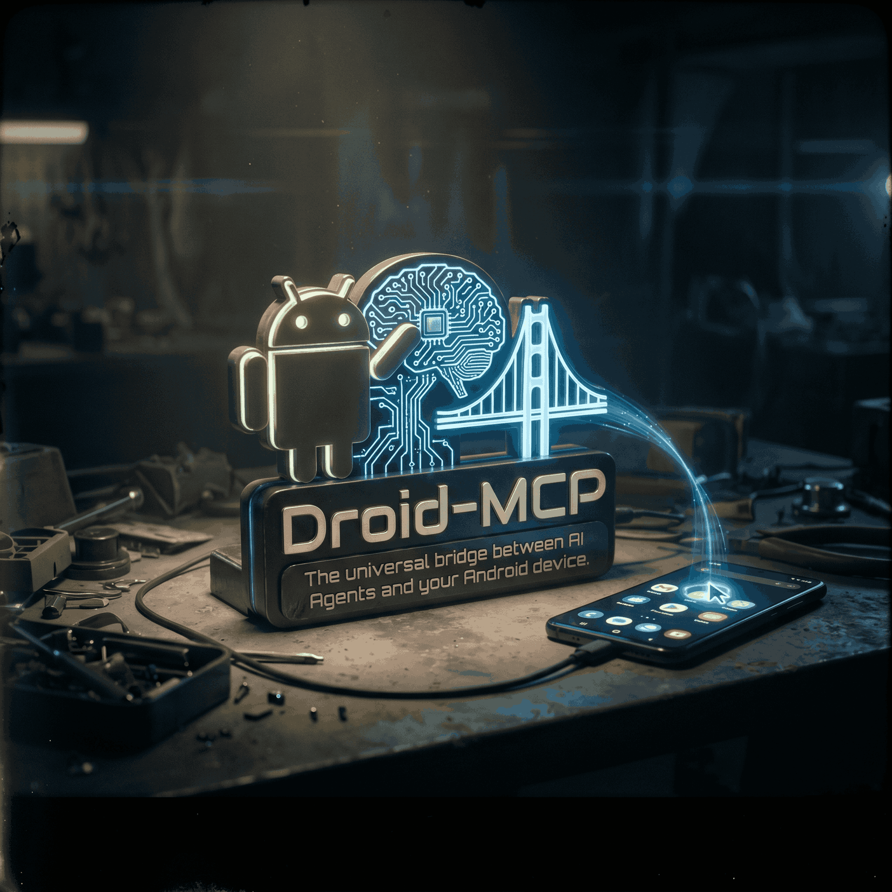

# Droid MCP Server 🤖📱



A Headless Android Model Context Protocol (MCP) Server. 
Turns any Android device or emulator into an AI-native platform, allowing LLMs to interact directly with the OS.

## Features

| Tool | Description |
|------|-------------|
| `read_current_screen` | Parses UI Automator XML into clean, semantic JSON |
| `tap_screen` | Tap at specific X/Y coordinates |
| `long_press_screen` | Long-press at specific X/Y coordinates |
| `swipe_screen` | Swipe between two points |
| `type_text` | Type text into the focused field |
| `press_button` | Press physical system buttons (HOME, BACK, VOLUME, etc.) |
| `open_application` | Launch an app by package name |
| `open_url` | Open a URL in the browser |
| `get_android_device_info` | Retrieve battery, OS version, and model info |
| `get_device_state` | Get current device state (screen on/off, orientation, etc.) |
| `get_crash_logs` | Retrieve recent crash logs from logcat |
| `manage_network` | Toggle WiFi, mobile data, or airplane mode |
| `execute_adb_shell` | Run arbitrary ADB shell commands |
| `wait` | Pause execution for a given number of milliseconds |

## Architecture
Built with Clean Architecture principles using Python 3.11+, Pydantic for strict data validation, and the official Anthropic MCP SDK. *Start small, stay lean, scale smart.*

---

## 🔌 Setup & Installation

This server is designed to work seamlessly with LLMs via MCP Clients such as Cline (VS Code) and Claude Code.

### ⚠️ Prerequisites for macOS Users
If you are on a Mac and use Homebrew to manage Python, `tkinter` (required for the 1-Click UI) is not installed by default. Run this first:
```bash
brew install python-tk@3.11
```
*(Adjust the version number if you are using a different Python version).*

### 🚀 1-Click Auto-Linker
Forget manual JSON configurations and path issues. Run the built-in GUI to automatically link this MCP server to your AI client. It automatically captures your current environment's absolute paths.

1. Activate your virtual environment (if you use one).
2. Run the linker:
```bash
python link_gui.py
```
3. Click **"Link to VS Code (Cline)"** or **"Link to Claude Code"**.
4. **Restart your MCP client.** You will now see `droid-mcp` active in your MCP Servers list.

---

## 🎮 How to use (Prompt Examples)

Once connected, your LLM will automatically have access to the Android tools. Here is how you can command it:

**1. Information Gathering:**
> "Use your tools to check my connected Android device's battery level and OS version."

**2. Screen Reading:**
> "Read the current screen and list all the visible apps and buttons."

**3. Action & Interaction (The Boss Level):**
> "I want you to open Gmail. First, read the current screen to find the bounding box coordinates for 'Gmail'. Calculate the center X and Y coordinates. Finally, use the tap_screen tool to click exactly on that center point."

**4. Crash Debugging:**
> "Get the latest crash logs from my device and tell me what app crashed and why."

**5. Network Control:**
> "Toggle airplane mode on, wait 3 seconds, then turn it off."
